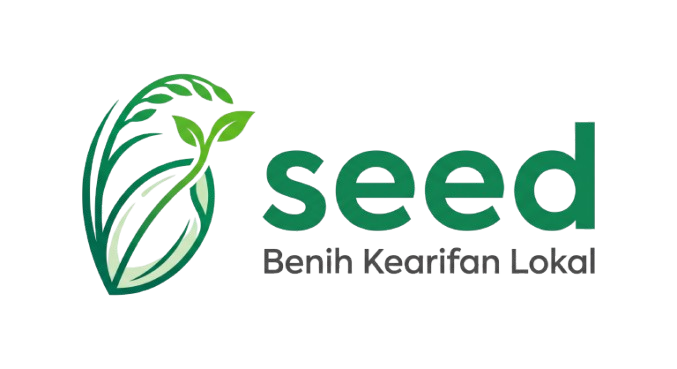

<p align="center">
  
</p>

<h1 align="center">🌾 Seed AI</h1>

<p align="center">
  <strong>Smart Early Evaluation & Disease Detection</strong><br>
  Sistem Cerdas Deteksi Dini Penyakit Tanaman Padi Berbasis AI
</p>

<p align="center">
  
  
  
  
  
  
</p>

---

## 📖 Daftar Isi

- [Project Overview](#-project-overview)
- [Fitur Utama](#-fitur-utama)
- [Arsitektur Sistem](#-arsitektur-sistem)
- [Prerequisites](#-prerequisites)
- [Installation Guide](#-installation-guide)
- [Environment Variables (.env)](#-environment-variables-env)
- [Folder Structure](#-folder-structure)
- [Database Migration & Seeding](#-database-migration--seeding)
- [API Documentation](#-api-documentation)
- [Deployment Guideline](#-deployment-guideline)
- [Kredit & Atribusi](#-kredit--atribusi)
- [Lisensi](#-lisensi)

---

## 🌱 Project Overview

**Seed AI** adalah platform web cerdas yang membantu petani padi Indonesia mendeteksi penyakit tanaman secara dini menggunakan kecerdasan buatan (AI). Platform ini dirancang khusus untuk ekosistem pertanian Indonesia dengan pendekatan berbasis data lokal dan kearifan nusantara.

Petani cukup mengunggah foto daun padi yang terinfeksi, dan sistem akan:

1. **Mengklasifikasikan** jenis penyakit menggunakan model Deep Learning (MobileNetV2 *fine-tuned*).
2. **Mengambil data cuaca real-time** berdasarkan lokasi GPS pengguna melalui Open-Meteo API, dengan BMKG sebagai *fallback*.
3. **Menghasilkan rekomendasi perawatan kontekstual** menggunakan Gemini AI (RAG — Retrieval Augmented Generation) yang diperkaya dengan basis pengetahuan lokal dan data iklim terkini.
4. **Menyarankan produk obat** yang bisa langsung dibeli di Tokopedia, serta resep **obat alami DIY** untuk menghemat pengeluaran.

Sistem ini dibangun dengan arsitektur **Microservices** yang sepenuhnya ter-kontainerisasi menggunakan Docker.

---

## ✨ Fitur Utama

| Fitur | Deskripsi |
|---|---|
| 🔬 **Diagnosa AI** | Unggah foto daun → Klasifikasi penyakit (CNN/MobileNetV2) → Rekomendasi AI (Gemini RAG) |
| 🌦️ **Cuaca Dinamis (GPS)** | Deteksi lokasi GPS pengguna → Ambil cuaca real-time dari Open-Meteo → Tampilkan di beranda → Kirim ke AI sebagai konteks |
| 🛒 **Katalog Produk** | AI menyarankan produk obat pertanian nyata beserta link langsung ke **pencarian Tokopedia** |
| 🌿 **Racikan Hemat DIY** | Resep obat alami dari bahan lokal (bawang putih, kunyit, kapur sirih, dll.) untuk menghemat biaya |
| 📰 **Portal Berita Pertanian** | Berita pertanian terkini dari RSS Antara News, di-*cache* selama 24 jam |
| 💬 **Forum Komunitas** | Ruang obrolan publik (AJAX *real-time*, tanpa reload halaman) bagi petani untuk berdiskusi |
| 📚 **Edukasi Kearifan Lokal** | Basis data pengetahuan pertanian lokal yang dikelola oleh Admin melalui panel CRUD |
| 🛡️ **Panel Admin** | Sidebar modern dengan dark theme, manajemen admin, dan CRUD kearifan lokal |
| ⚡ **Optimasi Performa** | Caching 24 jam untuk berita, *thread-safe* TensorFlow inference, AJAX form submission |

---

## 🏗 Arsitektur Sistem

```
┌─────────────┐
│   Browser   │  ── Geolocation API ──► Open-Meteo (Cuaca)
│  (Petani)   │  ── Nominatim ────────► Reverse Geocoding
└──────┬──────┘
       │ HTTPS
       ▼
┌──────────────────────────────────────────────────────────┐
│  Docker Compose Network                                   │
│                                                           │
│  ┌──────────────┐         ┌────────────────────┐          │
│  │   web         │  HTTP   │   ai-engine         │         │
│  │  Laravel 11   │ ──────► │  FastAPI + Python   │         │
│  │  PHP 8.4-FPM  │         │  TensorFlow 2.16   │         │
│  │  Port: 8000   │         │  Gemini AI (RAG)    │         │
│  └──────┬────────┘         │  Port: 8001         │         │
│         │                  └────────────────────┘          │
│         │                                                  │
│  ┌──────▼────────┐         ┌────────────────────┐          │
│  │   db           │         │   tunnel (Opsional) │         │
│  │  MySQL 8.0     │         │  Cloudflare Tunnel  │         │
│  │  Port: 3306    │         │  Expose ke Internet │         │
│  └───────────────┘         └────────────────────┘          │
│                                                           │
│  [API Eksternal]                                          │
│  ├── Open-Meteo API ── Cuaca real-time (via lat/lng)      │
│  ├── Antara News RSS ─ Berita pertanian                   │
│  ├── Nominatim OSM ─── Reverse geocoding                  │
│  └── Tokopedia ──────── Link pencarian produk             │
└──────────────────────────────────────────────────────────┘
```

---

## 📋 Prerequisites

Pastikan software berikut telah terinstal di sistem Anda sebelum memulai:

| Software | Versi Minimum | Keterangan |
|---|---|---|
| **Docker** | 24.x | Menjalankan semua container |
| **Docker Compose** | 2.x | Orkestrasi multi-container |
| **Git** | 2.x | Clone repository |

> **Catatan:** Jika ingin menjalankan **tanpa Docker** (bare metal), Anda juga memerlukan:
> - PHP >= 8.4 + ekstensi `gd`, `pdo_mysql`, `simplexml`
> - Composer >= 2.x
> - Python >= 3.10 + pip
> - MySQL >= 8.0
> - Node.js >= 18 (opsional, untuk build Tailwind)

---

## 🚀 Installation Guide

### Metode 1: Docker (Direkomendasikan)

```bash
# 1. Clone repositori
git clone https://github.com/your-username/seed-ai.git
cd seed-ai

# 2. Salin file environment
cp backend-core/.env.example backend-core/.env

# 3. Sesuaikan variabel di backend-core/.env
#    Minimal yang WAJIB diisi: GEMINI_API_KEY
#    Pastikan DB_HOST=db (bukan localhost)

# 4. Build dan jalankan semua container
docker-compose up -d --build

# 5. Jalankan migrasi database
docker-compose exec web php artisan migrate

# 6. Generate application key (jika belum ada)
docker-compose exec web php artisan key:generate

# 7. Buat symbolic link untuk storage
docker-compose exec web php artisan storage:link
```

Setelah semua langkah selesai, aplikasi dapat diakses di:

| Service | URL | Keterangan |
|---|---|---|
| **Web App** | http://localhost:8080 | Halaman utama aplikasi |
| **Admin Panel** | http://localhost:8080/admin/login | Panel admin (CRUD) |
| **AI Engine** | http://localhost:8081 | API inferensi model |
| **MySQL** | localhost:3307 | Koneksi via client DB |

### Metode 2: Tanpa Docker (Bare Metal)

```bash
# 1. Clone repositori
git clone https://github.com/your-username/seed-ai.git
cd seed-ai

# --- Backend Laravel ---
cd backend-core
cp .env.example .env
composer install
php artisan key:generate
php artisan migrate
php artisan storage:link
php artisan serve --port=8000

# --- AI Engine (buka terminal baru) ---
cd ../api-python
python -m venv venv
# Linux/Mac:
source venv/bin/activate
# Windows:
# venv\Scripts\activate
pip install -r requirements.txt
uvicorn main:app --host 0.0.0.0 --port 8001 --reload
```

> **Penting:** Pada mode bare metal, ubah `AI_API_URL` di `.env` menjadi `http://localhost:8001` dan `DB_HOST` menjadi `127.0.0.1`.

---

## 🔐 Environment Variables (`.env`)

File konfigurasi utama berada di `backend-core/.env`. Berikut daftar variabel yang dibutuhkan:

### Backend Laravel (`backend-core/.env`)

| Variabel | Contoh Nilai | Deskripsi |
|---|---|---|
| `APP_NAME` | `SeedAI` | Nama aplikasi yang tampil di tab browser |
| `APP_ENV` | `local` / `production` | Mode environment Laravel |
| `APP_KEY` | `base64:xxxxx` | Kunci enkripsi — generate via `php artisan key:generate` |
| `APP_DEBUG` | `true` / `false` | Mode debug — **WAJIB `false` di production** |
| `APP_URL` | `http://localhost:8080` | URL dasar aplikasi |
| `DB_CONNECTION` | `mysql` | Driver database |
| `DB_HOST` | `db` (Docker) / `127.0.0.1` | Hostname database |
| `DB_PORT` | `3306` | Port database |
| `DB_DATABASE` | `backend_core` | Nama database |
| `DB_USERNAME` | `root` | Username database |
| `DB_PASSWORD` | `secret` | Password database — **ganti di production** |
| `CACHE_STORE` | `file` | Driver cache (`file`, `database`, atau `redis`) |
| `SESSION_DRIVER` | `database` | Driver sesi pengguna |
| `GEMINI_API_KEY` | `AIzaSyXXXXXXXXXXX` | API Key untuk Google Gemini AI — **wajib diisi** |
| `AI_API_URL` | `http://ai-engine:8001` | URL internal menuju service AI Engine |
| `ADMIN_SECRET_CODE` | `SEED123` | Kode rahasia untuk registrasi admin baru |

### AI Engine (`api-python/.env`)

| Variabel | Contoh Nilai | Deskripsi |
|---|---|---|
| `GEMINI_API_KEY` | `AIzaSyXXXXXXXXXXX` | API Key Gemini (otomatis dibaca dari `backend-core/.env` via Docker `env_file`) |
| `GEMINI_MODEL` | `gemini-2.5-flash` | Nama model Gemini yang digunakan (default: `gemini-2.5-flash`) |

---

## 📁 Folder Structure

```
seed-ai/
│
├── api-python/                    # 🐍 Microservice AI Engine (FastAPI)
│   ├── main.py                    #    Entry point FastAPI
│   ├── requirements.txt           #    Dependensi Python
│   ├── routes/
│   │   └── predict.py             #    Endpoint /predict & /recommend
│   ├── model/
│   │   ├── model_penyakit_padi_v2_finetuned.h5  # Model CNN (MobileNetV2)
│   │   └── class_labels.json      #    Label kelas penyakit
│   ├── data/
│   │   └── knowledge_base.json    #    Knowledge Base untuk RAG
│   └── utils/
│       ├── gemini_rag.py          #    Logika RAG + Gemini prompting + produk & DIY
│       ├── preprocessing.py       #    Preprocessing gambar input
│       ├── labels.py              #    Loader label kelas
│       └── validation.py          #    Validasi file upload
│
├── backend-core/                  # 🟥 Monolith Backend (Laravel 11)
│   ├── app/
│   │   ├── Http/Controllers/
│   │   │   ├── HomeController.php         # Beranda
│   │   │   ├── DiagnosaController.php     # Upload foto + panggil AI + cuaca
│   │   │   ├── CommunityController.php    # Forum & Berita (AJAX)
│   │   │   └── Admin/
│   │   │       ├── AuthController.php         # Login Admin
│   │   │       ├── UserController.php         # Manajemen User Admin
│   │   │       └── KearifanLokalController.php # CRUD Edukasi
│   │   ├── Models/
│   │   │   ├── Diagnosa.php         # Model hasil diagnosa
│   │   │   ├── ForumMessage.php     # Model pesan forum
│   │   │   ├── KearifanLokal.php    # Model edukasi pertanian
│   │   │   └── User.php            # Model admin
│   │   └── Services/
│   │       ├── AIService.php        # HTTP Client ke AI Engine
│   │       ├── BmkgWeatherService.php # Fallback cuaca BMKG (XML parser)
│   │       ├── NewsService.php      # Parser RSS Berita Antara (cache 24 jam)
│   │       └── ImageService.php     # Penyimpanan file gambar
│   │
│   ├── resources/views/
│   │   ├── layouts/app.blade.php    # Layout utama (Tailwind CDN + Alpine.js)
│   │   ├── pages/
│   │   │   ├── home.blade.php       # Halaman diagnosa + cuaca dinamis
│   │   │   ├── result.blade.php     # Hasil diagnosa + katalog produk + DIY
│   │   │   ├── edukasi.blade.php    # Halaman edukasi
│   │   │   └── komunitas.blade.php  # Forum (AJAX) + Berita
│   │   ├── admin/
│   │   │   ├── layout.blade.php     # Layout admin (sidebar dark theme)
│   │   │   ├── login.blade.php      # Login admin (glassmorphism)
│   │   │   ├── kearifan_lokal/      # CRUD views kearifan lokal
│   │   │   └── users/               # CRUD views manajemen admin
│   │   └── components/
│   │       ├── header.blade.php     # Navigasi utama (logo + menu)
│   │       └── footer.blade.php     # Footer
│   │
│   ├── routes/web.php               # Definisi routing
│   └── .env                         # Konfigurasi environment
│
├── deployment/                    # 🐳 Konfigurasi Docker
│   ├── Dockerfile.web             #    Image PHP 8.4 + Laravel
│   └── Dockerfile.api             #    Image Python 3.10 + TF
│
├── docker-compose.yml             # 🐳 Orkestrasi semua services
└── README.md                      # 📖 Dokumentasi ini
```

---

## 🗄️ Database Migration & Seeding

### Menjalankan Migrasi

```bash
# Dengan Docker
docker-compose exec web php artisan migrate

# Tanpa Docker
cd backend-core && php artisan migrate
```

### Daftar Tabel yang Dibuat

| Tabel | Deskripsi |
|---|---|
| `users` | Data admin yang memiliki akses ke panel admin |
| `diagnosas` | Riwayat hasil diagnosa AI (penyakit, akurasi, rekomendasi, lokasi) |
| `kearifan_lokals` | Konten edukasi pertanian lokal (CRUD via Admin) |
| `forum_messages` | Pesan obrolan di forum komunitas |
| `cache` | Tabel cache Laravel (untuk driver `database`) |
| `sessions` | Sesi pengguna aktif |
| `jobs` | Antrian pekerjaan latar belakang |
| `personal_access_tokens` | Token API Sanctum (opsional) |

### Menjalankan Seeder (Opsional)

```bash
docker-compose exec web php artisan db:seed
```

### Membuat Admin Pertama

Akses `/admin/login` lalu registrasi admin baru menggunakan kode akses yang ada di `ADMIN_SECRET_CODE` pada file `.env`.

---

## 📡 API Documentation

### 1. Prediksi Penyakit Padi (Web Form)

| | |
|---|---|
| **Method** | `POST` |
| **URL** | `/predict` |
| **Content-Type** | `multipart/form-data` |
| **Tipe** | Laravel Web Route (Form Submission) |

**Request Body:**

| Field | Tipe | Wajib | Deskripsi |
|---|---|---|---|
| `image` | File (JPG/PNG) | ✅ | Foto daun padi yang diduga terinfeksi (maks. 5MB) |
| `latitude` | String | ❌ | Latitude lokasi pengguna (dari Geolocation API) |
| `longitude` | String | ❌ | Longitude lokasi pengguna |
| `location_name` | String | ❌ | Nama lokasi hasil reverse geocoding |
| `weather_info` | String | ❌ | Data cuaca dari Open-Meteo (otomatis terisi via JS) |

**Response:** Redirect ke halaman `/result` yang menampilkan hasil diagnosa.

---

### 2. AI Engine — Prediksi Langsung (Internal)

| | |
|---|---|
| **Method** | `POST` |
| **URL** | `http://ai-engine:8001/predict` |
| **Content-Type** | `multipart/form-data` |

**Request Body:**

| Field | Tipe | Wajib | Deskripsi |
|---|---|---|---|
| `file` | File (JPG/PNG) | ✅ | Foto daun padi |
| `weather` | String | ❌ | String cuaca: `"Suhu: 30°C, Kelambapan: 75%, Kondisi: Cerah"` |

**Response (JSON):**

```json
{
  "penyakit": "Bacterial Leaf Blight",
  "akurasi": 94.73,
  "rekomendasi": {
    "Analisis": "Tanaman padi terdeteksi terkena **Hawar Daun Bakteri**...",
    "Langkah Preventif": "1. **Gunakan varietas tahan** — Inpari 32...\n2. ...",
    "Rekomendasi Obat": "1. **Bakterisida Streptomycin** — dosis 2ml/L...",
    "Produk": [
      {
        "nama": "Agrept 20 WP",
        "bahan_aktif": "Streptomycin Sulfat 20%",
        "harga": "Rp 35.000 - 50.000/50g",
        "keyword": "bakterisida agrept 20 wp"
      }
    ],
    "DIY": "1. **Larutan Bawang Putih** — Bahan: 200g bawang putih, 1L air..."
  }
}
```

---

### 3. Forum — Kirim Pesan (AJAX)

| | |
|---|---|
| **Method** | `POST` |
| **URL** | `/komunitas/message` |
| **Content-Type** | `application/x-www-form-urlencoded` |

**Request Body:**

| Field | Tipe | Wajib | Deskripsi |
|---|---|---|---|
| `sender_name` | String | ✅ | Nama pengirim (maks. 50 karakter) |
| `message` | String | ✅ | Isi pesan (maks. 500 karakter) |
| `_token` | String | ✅ | CSRF Token Laravel |

**Response (JSON — AJAX mode):**

```json
{
  "success": true,
  "message": "Pesan terkirim"
}
```

---

### 4. AI Engine — Health Check

| | |
|---|---|
| **Method** | `GET` |
| **URL** | `http://ai-engine:8001/` |

**Response:**

```json
{
  "message": "Server API MangsaPadi Menyala dan Siap Menerima Foto!"
}
```

---

## 🚢 Deployment Guideline

### A. Deploy ke Google Cloud Run (Sangat Direkomendasikan)

Kami menyediakan script otomatis untuk men-deploy aplikasi ini ke **Google Cloud Run** dan **Cloud SQL**.

**Cara Termudah (Menggunakan Google Cloud Shell):**
1. Buka [Google Cloud Console](https://console.cloud.google.com).
2. Aktifkan **Cloud Shell** (ikon terminal `>_` di pojok kanan atas).
3. Jalankan perintah berikut:
   ```bash
   git clone https://github.com/faiz-jihad/hackathonITB.git seed-ai
   cd seed-ai
   chmod +x deployment/deploy_cloudrun.sh
   ./deployment/deploy_cloudrun.sh
   ```
4. Masukkan **Project ID** Anda, lalu pilih **opsi 4** untuk membuat Database dan men-deploy semua service secara otomatis.

*(Bagi pengguna Windows lokal, tersedia juga script `deployment/deploy_cloudrun.ps1`)*

### B. Deploy via Docker (VPS / Server Pribadi)

```bash
# 1. Pastikan .env sudah dikonfigurasi untuk produksi
#    APP_ENV=production
#    APP_DEBUG=false
#    APP_URL=https://your-domain.com
#    DB_PASSWORD=<password-aman>
#    ADMIN_SECRET_CODE=<kode-rahasia-baru>

# 2. Build & jalankan semua container
docker-compose up -d --build

# 3. Jalankan migrasi di container
docker-compose exec web php artisan migrate --force

# 4. Optimalkan Laravel untuk produksi
docker-compose exec web php artisan config:cache
docker-compose exec web php artisan route:cache
docker-compose exec web php artisan view:cache

# 5. (Opsional) Ekspos ke internet via Cloudflare Tunnel
docker-compose up -d tunnel
```

### C. Checklist Sebelum Deploy

- [ ] `APP_DEBUG=false`
- [ ] `APP_ENV=production`
- [ ] `APP_URL` sesuai domain produksi
- [ ] `GEMINI_API_KEY` terisi dan valid
- [ ] `ADMIN_SECRET_CODE` **diganti** dari default
- [ ] `DB_PASSWORD` **diganti** dari `secret`
- [ ] `CACHE_STORE=file` (atau `redis` jika tersedia)
- [ ] Model AI (`model_penyakit_padi_v2_finetuned.h5`) tersedia di `api-python/model/`

### D. Perintah Maintenance

```bash
# Membersihkan semua cache
docker-compose exec web php artisan optimize:clear

# Melihat log error
docker-compose exec web tail -f storage/logs/laravel.log

# Restart AI Engine (setelah update model/prompt)
docker-compose restart ai-engine

# Melihat log real-time container tertentu
docker-compose logs -f web
docker-compose logs -f ai-engine

# Melihat status semua container
docker-compose ps
```

---

## 🙏 Kredit & Atribusi

| Komponen | Sumber |
|---|---|
| **Data Cuaca** | [Open-Meteo](https://open-meteo.com) (utama) & [BMKG](https://data.bmkg.go.id) (fallback) |
| **Berita Pertanian** | [Antara News — Kantor Berita Indonesia](https://www.antaranews.com) |
| **Reverse Geocoding** | [OpenStreetMap Nominatim](https://nominatim.openstreetmap.org) |
| **AI Classification** | MobileNetV2 (TensorFlow), *fine-tuned* pada dataset penyakit padi |
| **AI Generatif** | Google Gemini AI (Retrieval Augmented Generation) |
| **Marketplace** | Link pencarian produk ke [Tokopedia](https://www.tokopedia.com) |

---

## 📄 Lisensi

Proyek ini dilisensikan di bawah ketentuan [MIT License](LICENSE).

---

<p align="center">
  Dibuat dengan ❤️ untuk Petani Indonesia 🌾
</p>