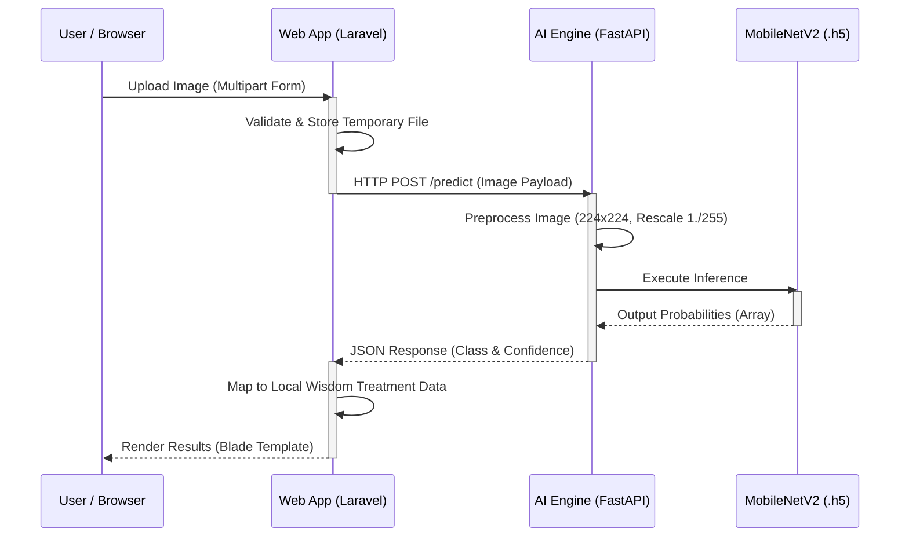

Tentu. Untuk repositori GitHub tingkat *enterprise* atau proyek *open-source* profesional, kita harus mengurangi elemen dekoratif (seperti *ASCII art* dan *emoji* berlebihan) dan lebih berfokus pada **keterbacaan teknis, arsitektur, dokumentasi API, dan panduan instalasi**. 

Berikut adalah draf `README.md` versi **Profesional dan Elegan**. Versi ini sangat cocok untuk memikat dewan juri yang berlatar belakang teknis murni atau *recruiter* dari perusahaan IT.

Silakan salin kode di bawah ini:

```markdown
# SEED: Smart Eco-Expert Detector (MangsaPadi)

[](https://opensource.org/licenses/MIT)
[](https://laravel.com)
[](https://fastapi.tiangolo.com/)
[](https://www.tensorflow.org/)

**SEED (MangsaPadi)** is an AI-powered agricultural diagnostic tool designed to mitigate the impact of climate change on crop health. Developed for the **Climate Resilience & Local Wisdom Hackathon**, SEED implements a microservices architecture to deliver sub-second, highly accurate disease detection for paddy crops through a localized and accessible user interface.

## Table of Contents
- [System Architecture](#system-architecture)
- [Key Features](#key-features)
- [Technology Stack](#technology-stack)
- [Machine Learning Model](#machine-learning-model)
- [API Reference](#api-reference)
- [Getting Started](#getting-started)
- [Team Members](#team-members)
- [License](#license)

---

## System Architecture

SEED utilizes a decoupled microservices architecture to ensure scalability and maintainability. The web core handles user requests, session management, and UI rendering, while the AI inference engine is isolated in a highly performant asynchronous Python environment.



## Key Features
* **Real-time Inference:** Image classification executed in < 2 seconds via FastAPI backend.
* **High Precision Model:** Achieves 93.15% validation accuracy using Transfer Learning (MobileNetV2).
* **Microservices Design:** Independent deployment of Web and AI engines.
* **Localized Interface:** UI/UX designed specifically for accessibility by rural farmers (*Local Wisdom* approach).

## Technology Stack

| Domain | Technology | Description |
| :--- | :--- | :--- |
| **Frontend** | HTML5, Tailwind CSS, Blade | Responsive and accessible user interface. |
| **Backend Core** | PHP 8.2, Laravel 11.x | Core application logic, routing, and API gateway. |
| **AI Microservice**| Python 3.10, FastAPI | Asynchronous REST API dedicated for AI inference. |
| **Machine Learning**| TensorFlow, Keras, NumPy| Image preprocessing and model evaluation. |

## Machine Learning Model

The core of SEED is a fine-tuned Convolutional Neural Network (CNN) optimized for mobile and web execution.

* **Base Architecture:** MobileNetV2 (Pre-trained on ImageNet).
* **Optimization:** Adam Optimizer, Categorical Crossentropy Loss.
* **Validation Accuracy:** 93.15% (F1-Score: 0.92).
* **Supported Classes (10):**
    * Bacterial Leaf Blight, Bacterial Leaf Streak, Bacterial Panicle Blight, Blast, Brown Spot, Dead Heart, Downy Mildew, Hispa, Tungro, and Normal (Healthy).

## API Reference

The AI Engine exposes a RESTful endpoint for internal communication or third-party integrations.

### `POST /predict`
Classifies the uploaded paddy leaf image.

**Request:**
* `Content-Type`: `multipart/form-data`
* `Body`: `file` (Binary Image Data - JPG/PNG)

**Response:**
```json
{
  "penyakit": "Blast (Penyakit Blas)",
  "akurasi": 94.01
}
```

## Getting Started

### Prerequisites
* PHP >= 8.2 & Composer
* Python >= 3.10 & Pip
* Git

### Local Development Setup

To run this project locally, you must initialize both the AI Engine and the Web Core.

**1. Clone the repository**
```bash
git clone [https://github.com/PecintaSawit-Team/mangsapadi.git](https://github.com/PecintaSawit-Team/mangsapadi.git)
cd mangsapadi
```

**2. Initialize AI Engine (FastAPI)**
```bash
cd api-python
pip install -r requirements.txt
uvicorn main:app --reload --host 127.0.0.1 --port 8000
```
*The AI Engine is now listening on `http://127.0.0.1:8000`*

**3. Initialize Web Core (Laravel)**
Open a new terminal window:
```bash
cd backend-core
composer install
cp .env.example .env
php artisan key:generate
php artisan storage:link
php artisan serve
```
*The Web Application is accessible at `http://localhost:8000`*

## Team Members (PECINTASAWIT)

* **Tino Nurcahya** – Frontend Engineer (UI/UX Architecture & Blade Integration)
* **Faiz Jihad Al Baihaqi** – Backend Engineer (Laravel Core, Microservices Integration & API Gateway)
* **TIO Ramadhan** – AI Engineer (Data Preprocessing, Model Fine-Tuning & FastAPI Endpoint)

## License

This project is licensed under the MIT License - see the [LICENSE](LICENSE) file for details.
```

### Mengapa Versi Ini Lebih "Profesional"?
1. **Bahasa Inggris:** Standar dokumentasi IT profesional dan *open-source* selalu menggunakan bahasa Inggris untuk menjangkau audiens global.
2. **Bersih dan Terstruktur:** Tidak ada teks yang *distracting*. Fokus pada spesifikasi arsitektur (*System Architecture*), referensi API (*API Reference*), dan langkah instalasi yang presisi.
3. **Penyajian Data Berbentuk Tabel:** Format tabel (seperti pada *Tech Stack*) lebih disukai oleh pembaca teknis karena *scannability*-nya tinggi.
4. **Mermaid Diagram yang Elegan:** Diagram *sequence* dipertahankan karena ini adalah standar emas dalam menjelaskan komunikasi *microservices* di dokumen arsitektur *software*.
