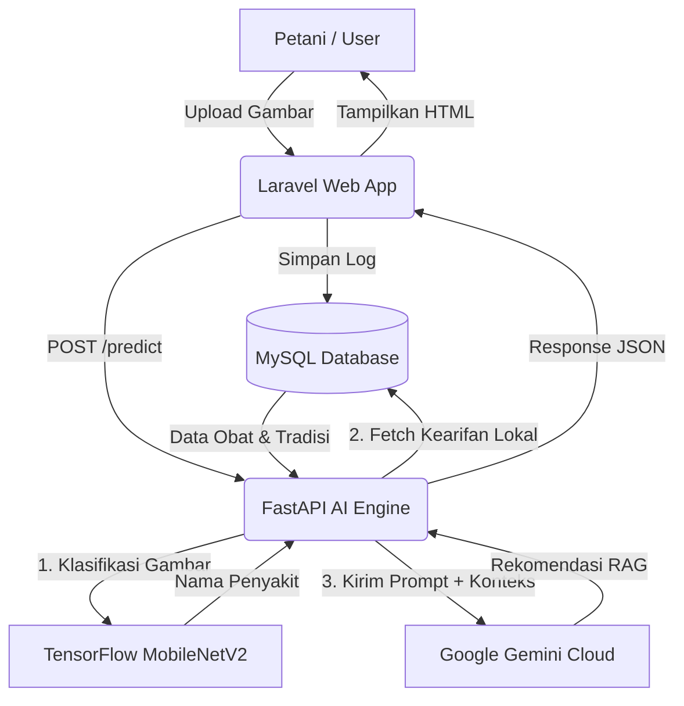

# Arsitektur Sistem & Tech Stack MangsaPadi S.E.E.D

Dokumen ini menjelaskan tumpukan teknologi (*tech stack*) dan alur kerja sistem dari aplikasi MangsaPadi. Aplikasi ini menggunakan pendekatan *Microservices* ringan yang berjalan di atas kontainer Docker.

---

## 🛠 Tech Stack (Tumpukan Teknologi)

### 1. Frontend & Backend (Layanan `web`)
Layanan ini menangani antarmuka pengguna, otentikasi admin, manajemen data, dan menjembatani *request* ke AI Engine.
- **Framework Utama**: Laravel 11 (PHP 8.2)
- **Styling UI**: Tailwind CSS, Bootstrap Icons / Phosphor Icons
- **Interaktivitas UI**: Alpine.js (Lightweight Javascript)
- **Server Web**: Nginx (Berjalan di dalam Docker bersama PHP-FPM)
- **Database**: MySQL 8.0 (Menyimpan data Kearifan Lokal dan Akun Admin)

### 2. AI Engine (Layanan `ai-engine`)
Layanan mandiri (API) yang khusus memproses gambar (Computer Vision) dan meracik kalimat cerdas (LLM).
- **Framework API**: FastAPI (Python 3.10)
- **Server ASGI**: Uvicorn
- **Computer Vision Model**: TensorFlow 2.16 (Menggunakan arsitektur *MobileNetV2* yang di-*finetune* untuk penyakit padi)
- **Image Processing**: Numpy, Pillow, OpenCV (via skrip pra-pemrosesan)
- **Generative AI (LLM)**: Google Generative AI SDK (`gemini-2.5-flash`)
- **Database Connector**: `mysql-connector-python` (Untuk melakukan koneksi langsung ke MySQL MySQL)

### 3. Infrastruktur & Deployment
- **Containerization**: Docker & Docker Compose
- **Penyimpanan Gambar**: Local Storage Volume (Laravel Storage Link)

---

## 🔄 Alur Kerja Sistem (System Workflow)

Berikut adalah bagaimana semua komponen teknologi di atas berinteraksi dalam satu kesatuan sistem:

### A. Alur Manajemen Data oleh Admin
1. **Admin** mengakses halaman `/admin/login` (Laravel) dan memasukkan email & password.
2. Saat Admin menambah/menghapus data Kearifan Lokal atau Admin lain, Admin memasukkan **Kode Akses Khusus**.
3. **Laravel Controller** memvalidasi *request*, mencocokkan kode rahasia dengan variabel `.env` (`ADMIN_SECRET_CODE`).
4. Jika valid, data (seperti nama penyakit, deskripsi obat, dll) disimpan ke **Database MySQL**.

### B. Alur Diagnosa Penyakit (User / Petani)
1. **Petani (Klien)** membuka halaman web dan mengunggah gambar daun padi yang sakit.
2. Klien mengirim *request* POST ke `DiagnosaController` (Laravel).
3. **Laravel** menyimpan gambar tersebut secara lokal (`storage/app/public/obat`), lalu **meneruskan (*forwarding*)** file gambar tersebut ke **FastAPI (Python)** melalui *HTTP Request* ke `http://ai-engine:8001/predict`.
4. **AI Engine (Python)** menerima gambar dan melakukan pra-pemrosesan (*resize, normalisasi*).
5. **TensorFlow (MobileNetV2)** memproses array gambar dan mengeluarkan probabilitas penyakit. Sistem mengambil hasil dengan akurasi tertinggi (misal: *Blast*).

### C. Alur RAG Dinamis (Retrieval-Augmented Generation)
Tepat setelah CNN (TensorFlow) mendeteksi nama penyakit, alur **RAG** dimulai:
1. **Retrieval**: Python AI Engine melakukan koneksi *database* ke MySQL secara langsung (menggunakan `mysql-connector-python`).
2. Python mencari *record* di tabel `kearifan_lokals` yang cocok dengan keyword "Blast".
3. Python merangkai (*Augmentation*) data dari MySQL (contoh: *Fungisida Amistar Top*, *Gunakan ekstrak mimba*) dan memasukkannya ke dalam sebuah "Prompt Super" bersama hasil prediksi CNN.
4. **Generation**: Prompt tersebut dikirim ke **Google Gemini API**.
5. **Gemini API** membaca semua instruksi dan menyusun paragraf rekomendasi (Bahasa Indonesia yang natural, langkah preventif, obat kimiawi, dan obat tradisional).
6. Rekomendasi final dikembalikan (Response JSON) dari **Python API -> Laravel -> Ditampilkan di layar Klien**.

---

## ⚡ Manajemen Konkurensi & Optimasi AI Engine (High Performance)

Mengingat aplikasi pertanian dapat diakses oleh banyak penyuluh atau petani secara serentak, *AI Engine* telah dioptimalkan agar tidak mengalami *bottleneck* (penumpukan antrean) saat memproses pemanggilan API AI eksternal dan Model TensorFlow yang berat:

1. **Synchronous Thread-Pooling di FastAPI**: 
   Pemanggilan ke Google Gemini API (*blocking I/O*) dan pemrosesan model TensorFlow (*blocking CPU*) sengaja **tidak menggunakan fungsi `async def`** pada rute `/predict`. Dengan mendefinisikan rute sebagai *synchronous* (`def predict`), `FastAPI` secara otomatis melemparkan eksekusi tersebut ke latar belakang menggunakan **ThreadPoolExecutor**. Artinya, puluhan *request* dari berbagai pengguna dalam waktu bersamaan akan ditangani secara paralel oleh *threads* berbeda, membiarkan *event-loop* utama tetap responsif melayani koneksi baru.
   
2. **Thread-Safe TensorFlow Inference**: 
   Fungsi klasik `model.predict()` pada TensorFlow 2.x memiliki *overhead* yang cukup tinggi (karena fitur *batching* dan *callbacks*) dan tidak 100% ideal untuk lingkungan *multithreading* yang berjalan terus-menerus. AI Engine menggunakan pemanggilan langsung objek Keras secara *native* (`model(img_array, training=False)`). Pendekatan ini lebih ringan, lebih cepat, dan **Thread-Safe**, menjamin akurasi yang konsisten saat ratusan gambar daun diproses oleh berbagai *thread* secara konkuren.

---

## Diagram Sederhana

